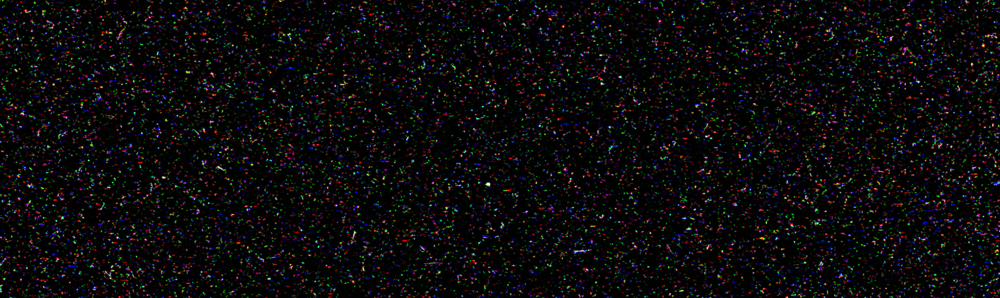

# COSMIC RAY CAMERA DISCOSAT-1: CMOS CHARACTERIZATION USING A PROTON BEAM

This project investigates the Coral CMOS camera’s potential as a cosmic ray detector in the DISCOSAT-1 CubeSat’s Image Processing Unit (IPU). The study involved irradiating the camera with a proton beam to simulate space conditions in Low Earth Orbit (LEO) and analyzing its durability, energy sensitivity, and dose response. In collaboration with Aarhus University and the DISCO program, experiments with various radiation sources (including ²³⁸U, ²⁰⁷Bi, and a PBS proton beam at AUH) were conducted. Image processing and machine learning were applied for feature extraction and data interpretation. The findings highlight the camera’s potential as a space radiation detector, though energy dependency results remain inconclusive due to limited data.

---

## Technologies Used

- **Python**: Core scripting language
- **NumPy & Pandas**: Numerical computations and structured data manipulation
- **Matplotlib**: Data visualization and plotting
- **OpenCV**: Image processing and pixel-level analysis
- **Scikit-learn**: Machine learning algorithms (e.g., classification, clustering)
- **Statistical Analysis**: Feature extraction, dose-response correlation, visualization

## Acknowledgements

- IT University of Copenhagen
- Aarhus University
- Danish Student CubeSat Program (DISCO)
- AUH Proton Therapy Center
